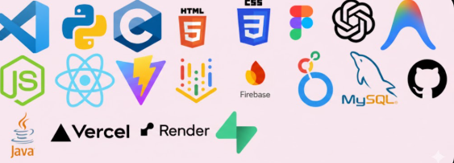

<!-- 🌸 Elegant Pink Header -->

  

  

---

## Hi there, I'm Afifa 👋🌸

I’m a Computer Science Engineering student passionate about building intelligent and impactful technology.  

I enjoy combining creativity with logic — from frontend design to AI systems.

Currently exploring Machine Learning, AI tools, and modern full-stack development.

---

## 🌷 About Me

- 🎓 CSE Student  
- 🤖 Interested in AI & Machine Learning  
- 💻 Exploring Full Stack Development  
- 🎨 Love working with UI/UX tools like Figma  
- 📊 Interested in data-driven decision systems  
- 🌱 Always learning and improving  

---

## 💗 Tech Stack

  

---

## 🌸 Current Focus

- Building AI-based solutions  
- Improving backend logic  
- Learning scalable system design  
- Strengthening communication & leadership  

---

## 🌷 Connect With Me

  
  

---

  🌸 “Consistency builds mastery.”

  

